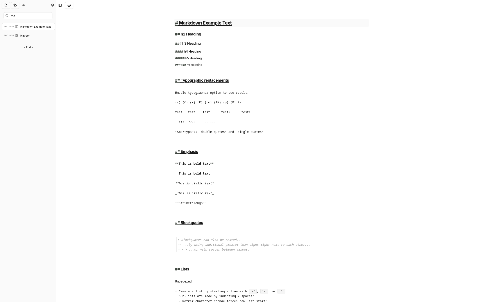
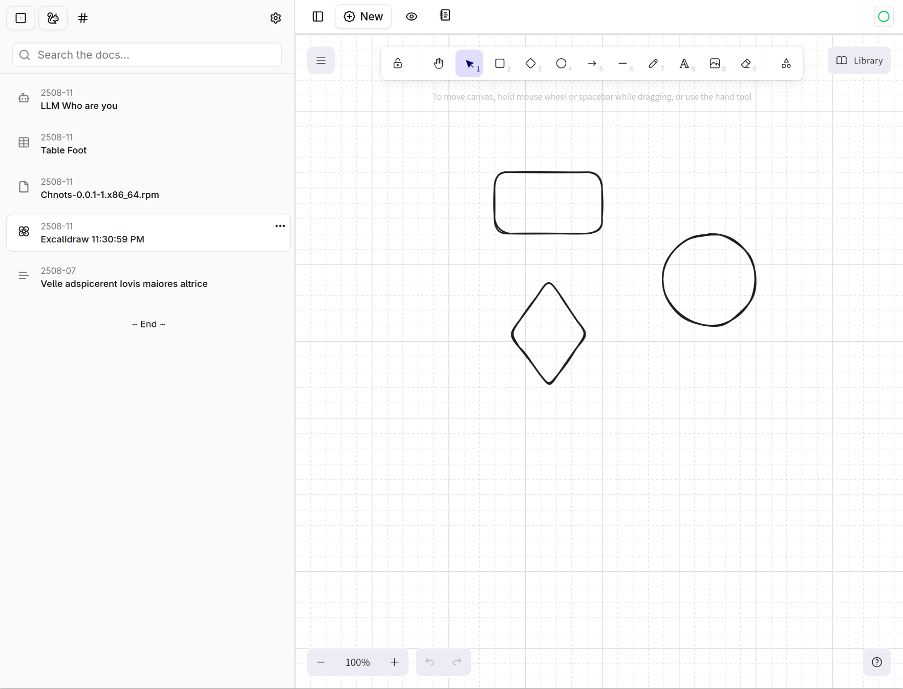
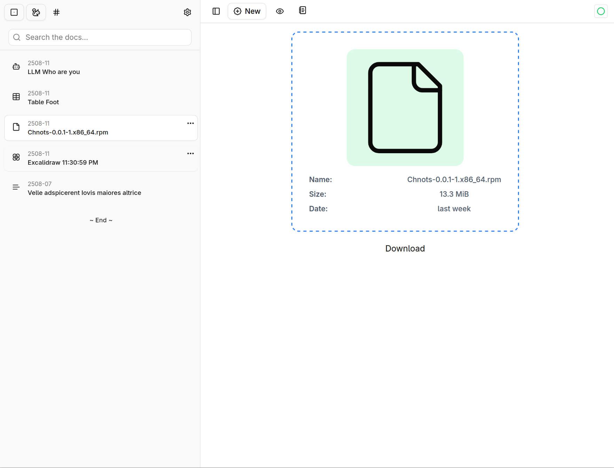
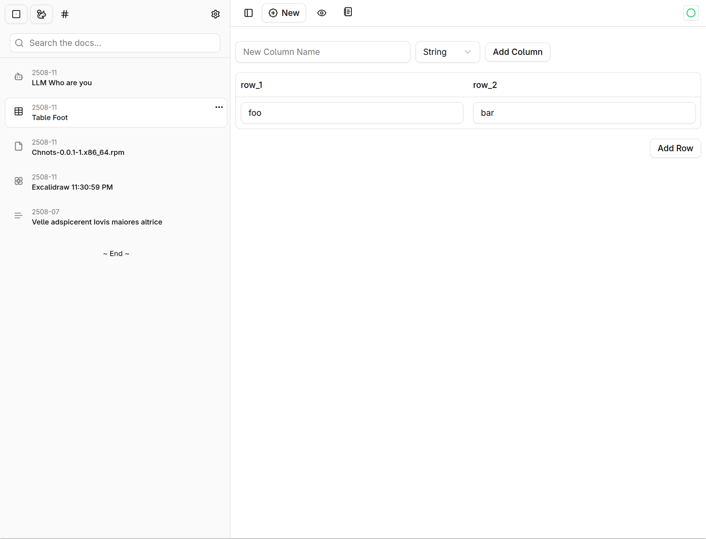
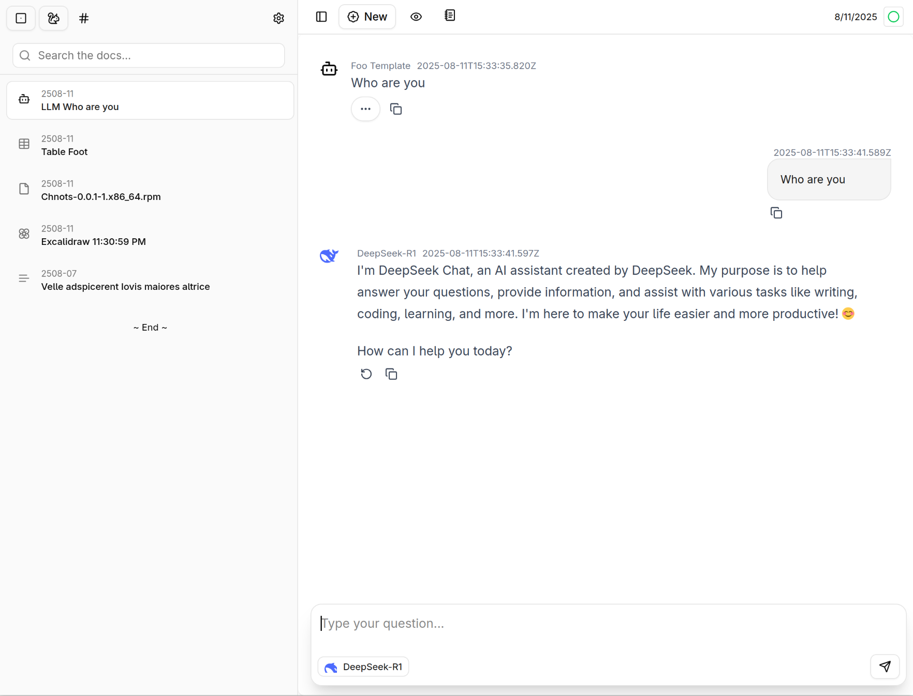

# _Chnots_

<p align="center">
  
</p>

> Record, Sync, Plan

## Overview

### Chnot Page

<p align="center">
  
</p>

### Drawing Page(Excalidraw)

<p align="center">
  
</p>

### File Page

<p align="center">
  
</p>

### Table View Page

<p align="center">
  
</p>

### LLMChat Page

<p align="center">
  
</p>

## Features

- Workspace Support
- P2P Sync
- Immutable Database
- Postgres/Sqlite Support
- Tag-based Chnot Management
- Todo/Event Management(with Chinese Calendar support)
- Multi-Platform Support(Server & Tauri App)

## Documents

- [Database Design(Chinese)](./docs/database.md)
- [Package And Release(Chinese)](./docs/release.md)

## Quick Start

```shell
mkdir chnots
git clone https://github.com/chnots/chnots.git
cd chnots

make init
make build-web
make run-server-sqlite
```

## Credits

- **Jolpin**: for its wonderful markdown and codemirror utils.
- **Excalidraw**: the powerful drawing tools.
- **tanstack-table**: the powerful table.
