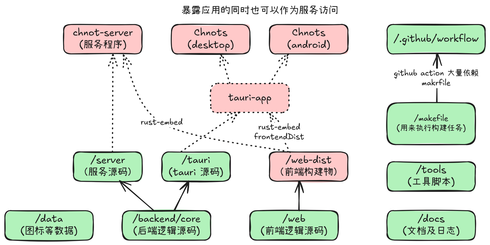

# 提交代码、发版部署逻辑

## 发版构建

`Chnots` 已经日用一段时间了，我感觉已经能满足我的一些日常需求了。比如记笔记(Markdown)、画图(Excalidraw)、LLM 对话，所以我决定放出第一个版本(v0.0.1)。

总的来说，`Chnots` 由 Rust 后端与 Typescript+React 前端组成。情况如下：

|           | Server   | App   |
| --------- | -------- | ----- |
| GNU/Linux | Vallina  | Tauri |
| Windows   | Vallina  | Tauri |
| Android   | 借助 App | Tauri |

理论上，该应用也能构建成 Macos 的，但是我没有苹果相关的设备，所以认为不支持。

本地基本上使用 make 命令进行构建；远程仓库则使用基于 makefile 的 github-action，其中大量借鉴了 `tauri-action` 和仓库中的讨论，在此鸣谢。

**打包样本**: 现在 github 能一次性打出来十多个包，大致包括 `{Server, App} * {AMD64, AARCH64} * {Windows, GNU/Linux, Android}` 的各种组合，基本满足了我对打包的设计。但是由于基本上都是自己组装的，所以鲁棒性还不够高，可能需要后继优化。

**触发条件**: 本项目只有一个 dev 和多个 feature 分支，只有推送 tag 时才会触发打包逻辑。

**版本命名**: 遵循 `semver` 规则。有 App Version 和 `DB_VERSION` 两部分，后者不参与发版，主要用于实例间的握手同步设计。

**打包时间**: 鉴于 Rust 打包速度比较慢，在 GNU/Linux 下需要打多遍包(Server, Chnots-Tauri-Desktop, Chnots-Tauri-Android)，所以这个过程就更长了，大概需要 20 分钟；Windows 下只需要打 Server 和 Desktop 版本，时间大概在 13 分钟左右。具体的打包过程可以参见 workflow 文件。

总之，当前的应用和打包过程已经到了一个初步可用的阶段（可能仅仅对我这个开发者来说是这样的）。下一步考虑是否可以优化打包时间。

## 提交代码

所有的代码在提交前利用 `pre-commit-hook` 美化代码，使用 `prettier` 与 `rustfmt` 两个工具进行。
